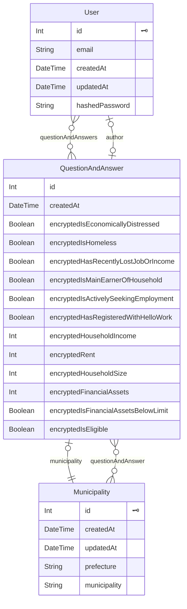

```mermaid
erDiagram

  "User" {
    Int id "🗝️"
    String email 
    DateTime createdAt 
    DateTime updatedAt 
    String hashedPassword 
    }
  

  "Municipality" {
    Int id "🗝️"
    DateTime createdAt 
    DateTime updatedAt 
    String prefecture 
    String municipality 
    }
  

  "QuestionAndAnswer" {
    Int id 
    DateTime createdAt 
    Boolean encryptedIsEconomicallyDistressed 
    Boolean encryptedIsHomeless 
    Boolean encryptedHasRecentlyLostJobOrIncome 
    Boolean encryptedIsMainEarnerOfHousehold 
    Boolean encryptedIsActivelySeekingEmployment 
    Boolean encryptedHasRegisteredWithHelloWork 
    Int encryptedHouseholdIncome 
    Int encryptedRent 
    Int encryptedHouseholdSize 
    Int encryptedFinancialAssets 
    Boolean encryptedIsFinancialAssetsBelowLimit 
    Boolean encryptedIsEligible 
    }
  
    "User" o{--}o "QuestionAndAnswer" : "questionAndAnswers"
    "Municipality" o{--}o "QuestionAndAnswer" : "questionAndAnswer"
    "QuestionAndAnswer" o|--|o "User" : "author"
    "QuestionAndAnswer" o|--|| "Municipality" : "municipality"
```
