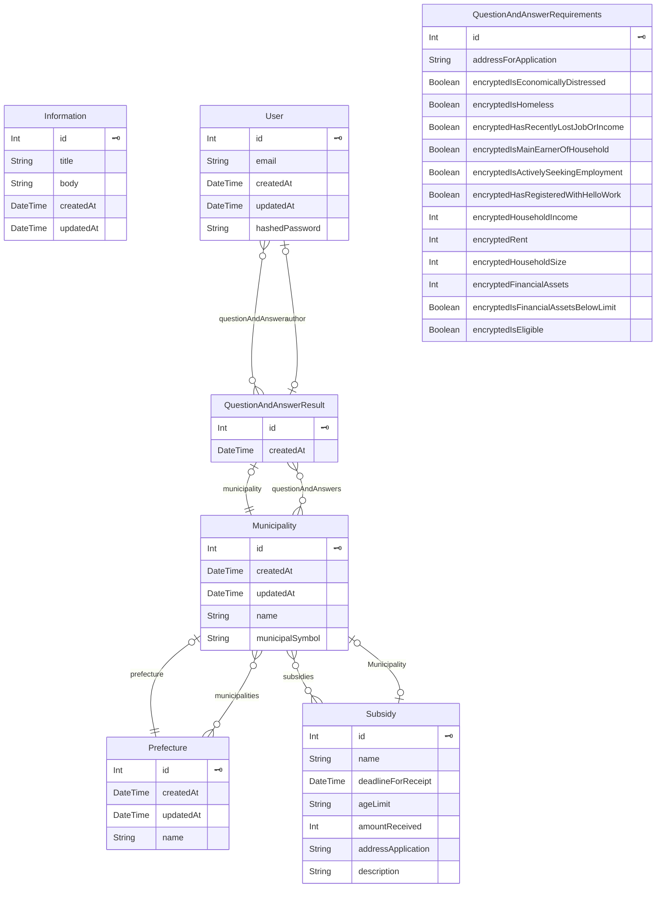

```mermaid
erDiagram

  "Information" {
    Int id "🗝️"
    String title 
    String body 
    DateTime createdAt 
    DateTime updatedAt 
    }
  

  "User" {
    Int id "🗝️"
    String email 
    DateTime createdAt 
    DateTime updatedAt 
    String hashedPassword 
    }
  

  "Municipality" {
    Int id "🗝️"
    DateTime createdAt 
    DateTime updatedAt 
    String name 
    String municipalSymbol 
    }
  

  "Prefecture" {
    Int id "🗝️"
    DateTime createdAt 
    DateTime updatedAt 
    String name 
    }
  

  "Subsidy" {
    Int id "🗝️"
    String name 
    DateTime deadlineForReceipt 
    String ageLimit 
    Int amountReceived 
    String addressApplication 
    String description 
    }
  

  "QuestionAndAnswerRequirements" {
    Int id "🗝️"
    String addressForApplication 
    Boolean encryptedIsEconomicallyDistressed 
    Boolean encryptedIsHomeless 
    Boolean encryptedHasRecentlyLostJobOrIncome 
    Boolean encryptedIsMainEarnerOfHousehold 
    Boolean encryptedIsActivelySeekingEmployment 
    Boolean encryptedHasRegisteredWithHelloWork 
    Int encryptedHouseholdIncome 
    Int encryptedRent 
    Int encryptedHouseholdSize 
    Int encryptedFinancialAssets 
    Boolean encryptedIsFinancialAssetsBelowLimit 
    Boolean encryptedIsEligible 
    }
  

  "QuestionAndAnswerResult" {
    Int id "🗝️"
    DateTime createdAt 
    }
  
    "User" o{--}o "QuestionAndAnswerResult" : "questionAndAnswers"
    "Municipality" o{--}o "QuestionAndAnswerResult" : "questionAndAnswers"
    "Municipality" o|--|| "Prefecture" : "prefecture"
    "Municipality" o{--}o "Subsidy" : "subsidies"
    "Prefecture" o{--}o "Municipality" : "municipalities"
    "Subsidy" o|--|o "Municipality" : "Municipality"
    "QuestionAndAnswerResult" o|--|o "User" : "author"
    "QuestionAndAnswerResult" o|--|| "Municipality" : "municipality"
```
