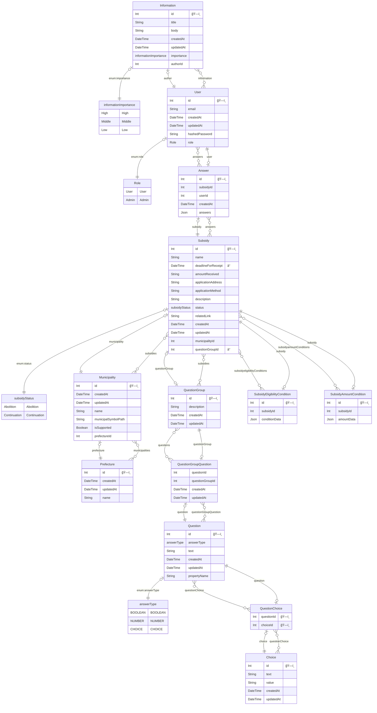

```mermaid
erDiagram

        Role {
            User User
Admin Admin
        }
    


        subsidyStatus {
            Abolition Abolition
Continuation Continuation
        }
    


        informationImportance {
            High High
Middle Middle
Low Low
        }
    


        answerType {
            BOOLEAN BOOLEAN
NUMBER NUMBER
CHOICE CHOICE
        }
    
  "Information" {
    Int id "ğŸ—ï¸"
    String title 
    String body 
    DateTime createdAt 
    DateTime updatedAt 
    informationImportance importance 
    Int authorId 
    }
  

  "User" {
    Int id "ğŸ—ï¸"
    String email 
    DateTime createdAt 
    DateTime updatedAt 
    String hashedPassword 
    Role role 
    }
  

  "Municipality" {
    Int id "ğŸ—ï¸"
    DateTime createdAt 
    DateTime updatedAt 
    String name 
    String municipalSymbolPath 
    Boolean isSupported 
    Int prefectureId 
    }
  

  "Prefecture" {
    Int id "ğŸ—ï¸"
    DateTime createdAt 
    DateTime updatedAt 
    String name 
    }
  

  "Subsidy" {
    Int id "ğŸ—ï¸"
    String name 
    DateTime deadlineForReceipt "â“"
    String amountReceived 
    String applicationAddress 
    String applicationMethod 
    String description 
    subsidyStatus status 
    String relatedLink 
    DateTime createdAt 
    DateTime updatedAt 
    Int municipalityId 
    Int questionGroupId "â“"
    }
  

  "Question" {
    Int id "ğŸ—ï¸"
    answerType answerType 
    String text 
    DateTime createdAt 
    DateTime updatedAt 
    String propertyName 
    }
  

  "QuestionGroup" {
    Int id "ğŸ—ï¸"
    String description 
    DateTime createdAt 
    DateTime updatedAt 
    }
  

  "Answer" {
    Int id "ğŸ—ï¸"
    Int subsidyId 
    Int userId 
    DateTime createdAt 
    Json answers 
    }
  

  "SubsidyEligibilityCondition" {
    Int id "ğŸ—ï¸"
    Int subsidyId 
    Json conditionData 
    }
  

  "SubsidyAmountCondition" {
    Int id "ğŸ—ï¸"
    Int subsidyId 
    Json amountData 
    }
  

  "QuestionGroupQuestion" {
    Int questionId 
    Int questionGroupId 
    DateTime createdAt 
    DateTime updatedAt 
    }
  

  "Choice" {
    Int id "ğŸ—ï¸"
    String text 
    String value 
    DateTime createdAt 
    DateTime updatedAt 
    }
  

  "QuestionChoice" {
    Int questionId "ğŸ—ï¸"
    Int choiceId "ğŸ—ï¸"
    }
  
    "Information" o|--|| "informationImportance" : "enum:importance"
    "Information" o|--|| "User" : "author"
    "User" o{--}o "Answer" : "answers"
    "User" o|--|| "Role" : "enum:role"
    "User" o{--}o "Information" : "information"
    "Municipality" o|--|| "Prefecture" : "prefecture"
    "Municipality" o{--}o "Subsidy" : "subsidies"
    "Prefecture" o{--}o "Municipality" : "municipalities"
    "Subsidy" o|--|| "subsidyStatus" : "enum:status"
    "Subsidy" o|--|| "Municipality" : "municipality"
    "Subsidy" o{--}o "Answer" : "answers"
    "Subsidy" o{--}o "SubsidyEligibilityCondition" : "subsidyeligibilityConditions"
    "Subsidy" o{--}o "SubsidyAmountCondition" : "subsidyamountConditions"
    "Subsidy" o|--|o "QuestionGroup" : "questionGroup"
    "Question" o|--|| "answerType" : "enum:answerType"
    "Question" o{--}o "QuestionGroupQuestion" : "questionGroupQuestion"
    "Question" o{--}o "QuestionChoice" : "questionChoice"
    "QuestionGroup" o{--}o "QuestionGroupQuestion" : "questions"
    "QuestionGroup" o{--}o "Subsidy" : "subsidies"
    "Answer" o|--|| "Subsidy" : "subsidy"
    "Answer" o|--|| "User" : "user"
    "SubsidyEligibilityCondition" o|--|| "Subsidy" : "subsidy"
    "SubsidyAmountCondition" o|--|| "Subsidy" : "subsidy"
    "QuestionGroupQuestion" o|--|| "Question" : "question"
    "QuestionGroupQuestion" o|--|| "QuestionGroup" : "questionGroup"
    "Choice" o{--}o "QuestionChoice" : "questionChoice"
    "QuestionChoice" o|--|| "Question" : "question"
    "QuestionChoice" o|--|| "Choice" : "choice"
```
